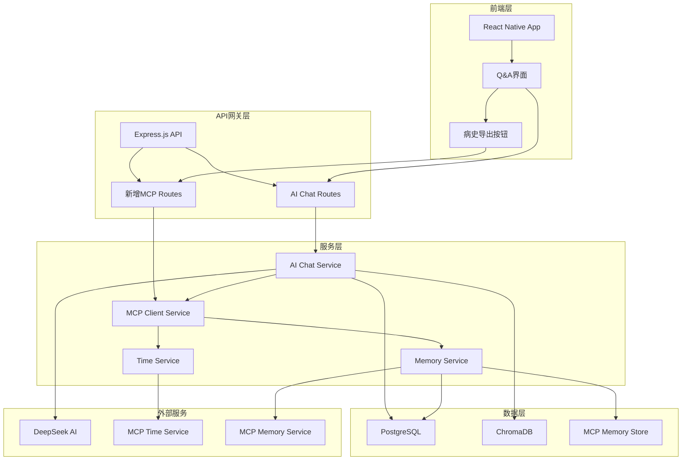

# OpenRD知识库项目MCP集成架构设计方案

## 1. 项目背景与目标

### 1.1 项目现状
- **前端**: React Native移动端Q&A界面（`apps/mobile/screens/p-qna/index.tsx`）
- **后端**: Express.js API服务（`apps/api/src/routes/ai-chat.routes.ts`）
- **AI服务**: 调用Python知识检索脚本 + DeepSeek AI模型
- **数据库**: PostgreSQL（已有chat_sessions、chat_messages、patient_statements表）
- **知识库**: ChromaDB向量数据库

### 1.2 MCP服务需求
1. **时间服务**: https://open.bigmodel.cn/api/mcp-broker/proxy/time/mcp
2. **记忆服务**: https://github.com/modelcontextprotocol/servers/tree/main/src/memory

### 1.3 核心目标
1. 在AI对话中接入MCP，使AI能够使用时间功能和记忆功能
2. 更新AI对话的提示词，提示使用记忆功能与时间功能
3. 实现在与用户的对话中，能够产生上下文记忆，自动梳理带时间的病史
4. 新增一个病史一键导出的功能，能够结合MCP记忆功能，生成一个带时间戳的病史，供患者与医生交流

## 2. 整体架构设计

### 2.1 架构图



### 2.2 组件职责

| 组件 | 职责 | 技术栈 |
|------|------|--------|
| **MCP Client Service** | 统一管理MCP服务连接、认证、调用 | TypeScript, @modelcontextprotocol/sdk |
| **Memory Manager** | 记忆的存储、检索、总结、清理 | TypeScript, PostgreSQL |
| **Time Service Client** | 获取当前时间、格式化时间戳 | TypeScript, Axios |
| **Prompt Enhancer** | 动态生成包含记忆和时间的提示词 | TypeScript, 模板引擎 |
| **History Exporter** | 生成病史文档并导出 | TypeScript, PDF生成库 |

## 3. MCP集成方式

### 3.1 MCP客户端设计

```typescript
// apps/api/src/services/mcp-client.service.ts
interface MCPClientConfig {
  timeServiceUrl: string;
  memoryServiceUrl: string;
  timeServiceApiKey?: string;
  memoryServiceAuth?: string;
}

class MCPClientService {
  async getCurrentTime(): Promise<TimeResponse>;
  async storeMemory(userId: string, content: MemoryContent): Promise<string>;
  async retrieveMemories(userId: string, limit?: number): Promise<Memory[]>;
  async summarizeMemories(userId: string): Promise<string>;
}
```

### 3.2 与现有AI服务集成

在现有AI对话流程中插入MCP调用：

```typescript
// 修改后的AI对话流程
1. 用户提问 → 2. 知识检索 → 3. 获取用户记忆 → 4. 获取当前时间 → 
5. 构建增强提示词 → 6. 调用DeepSeek → 7. 存储对话记忆 → 8. 返回回答
```

### 3.3 记忆存储策略

| 记忆类型 | 存储位置 | 生命周期 | 用途 |
|----------|----------|----------|------|
| **对话记忆** | MCP记忆服务 | 长期 | 上下文理解 |
| **症状时间线** | PostgreSQL + MCP | 永久 | 病史生成 |
| **用户偏好** | PostgreSQL | 长期 | 个性化回答 |

## 4. 数据流设计

### 4.1 时间数据流

```
用户提问 → API → MCP Time Service → 返回时间信息 → 
→ 整合到提示词 → AI生成回答 → 返回给用户
```

### 4.2 记忆数据流

```
用户对话 → 提取关键信息 → 存储到MCP记忆服务 → 
→ 下次对话时检索 → 整合到上下文 → 生成个性化回答
```

### 4.3 病史生成数据流

```
用户请求导出 → 检索所有相关记忆 → 按时间排序 → 
→ 调用AI总结 → 生成结构化病史 → 导出PDF/文档
```

## 5. 数据库扩展设计

### 5.1 新增表结构

```sql
-- 记忆元数据表（链接MCP记忆服务）
CREATE TABLE memory_metadata (
    id UUID PRIMARY KEY DEFAULT uuid_generate_v4(),
    user_id UUID NOT NULL REFERENCES app_users(id),
    mcp_memory_id VARCHAR(255) NOT NULL, -- MCP服务返回的记忆ID
    memory_type VARCHAR(50) NOT NULL, -- 'symptom', 'conversation', 'preference'
    summary TEXT, -- 记忆摘要
    created_at TIMESTAMPTZ DEFAULT NOW(),
    indexed_at TIMESTAMPTZ DEFAULT NOW()
);

-- 病史导出记录表
CREATE TABLE medical_history_exports (
    id UUID PRIMARY KEY DEFAULT uuid_generate_v4(),
    user_id UUID NOT NULL REFERENCES app_users(id),
    export_type VARCHAR(50) NOT NULL, -- 'full', 'timeline', 'summary'
    file_path TEXT,
    file_size INTEGER,
    memory_ids TEXT[], -- 引用的记忆ID数组
    generated_at TIMESTAMPTZ DEFAULT NOW(),
    expires_at TIMESTAMPTZ
);

-- 症状时间线表
CREATE TABLE symptom_timeline (
    id UUID PRIMARY DEFAULT uuid_generate_v4(),
    user_id UUID NOT NULL REFERENCES app_users(id),
    symptom_description TEXT NOT NULL,
    severity INTEGER CHECK (severity >= 1 AND severity <= 10),
    occurred_at TIMESTAMPTZ NOT NULL,
    recorded_at TIMESTAMPTZ DEFAULT NOW(),
    source_type VARCHAR(50) -- 'conversation', 'manual', 'ai_extracted'
);
```

### 5.2 索引优化

```sql
CREATE INDEX idx_memory_metadata_user_type ON memory_metadata(user_id, memory_type);
CREATE INDEX idx_symptom_timeline_user_time ON symptom_timeline(user_id, occurred_at);
CREATE INDEX idx_history_exports_user_time ON medical_history_exports(user_id, generated_at);
```

## 6. API端点设计

### 6.1 新增端点

| 端点 | 方法 | 描述 | 认证 |
|------|------|------|------|
| `/api/mcp/memories` | GET | 获取用户记忆列表 | JWT |
| `/api/mcp/memories` | POST | 存储新记忆 | JWT |
| `/api/mcp/memories/summary` | GET | 获取记忆摘要 | JWT |
| `/api/mcp/time/current` | GET | 获取当前时间 | JWT |
| `/api/medical-history/export` | POST | 导出病史文档 | JWT |
| `/api/medical-history/exports` | GET | 获取导出历史 | JWT |
| `/api/symptoms/timeline` | GET | 获取症状时间线 | JWT |
| `/api/symptoms/timeline` | POST | 添加症状记录 | JWT |

### 6.2 请求/响应示例

```typescript
// POST /api/medical-history/export
Request: {
  exportType: 'full' | 'timeline' | 'summary',
  dateRange?: { start: string, end: string },
  includeSymptoms: boolean,
  includeConversations: boolean
}

Response: {
  success: true,
  data: {
    exportId: string,
    fileUrl: string,
    fileSize: number,
    generatedAt: string
  }
}
```

## 7. 前端集成设计

### 7.1 修改Q&A界面

在现有Q&A界面（`apps/mobile/screens/p-qna/index.tsx`）中添加：

1. **记忆状态指示器**: 显示当前对话是否有相关记忆
2. **病史导出按钮**: 在搜索结果区域添加导出功能
3. **时间上下文显示**: 在回答中显示相关时间信息

### 7.2 新增病史导出界面

创建新的屏幕组件：
- `apps/mobile/screens/p-medical-history-export/index.tsx`
- 支持选择导出范围、格式、时间范围
- 预览生成的病史
- 分享/保存功能

### 7.3 API调用封装

```typescript
// apps/mobile/services/mcp-api.ts
class MCPApiService {
  async getMemories(): Promise<Memory[]>;
  async exportMedicalHistory(options: ExportOptions): Promise<ExportResult>;
  async getSymptomTimeline(): Promise<SymptomTimeline[]>;
}
```

## 8. 提示词更新策略

### 8.1 系统提示词增强

```typescript
const enhancedSystemPrompt = `
你是一个专业、友善的FSHD（面肩肱型肌营养不良症）健康科普助手。请严格遵循：

1) 优先依据"知识库资料片段"作答；不要编造不在片段中的事实
2) 用中文、分点、通俗易懂
3) 给出可执行的下一步建议（该看什么科/问医生什么/做什么检查）
4) 每次都要提醒：这不是医疗诊断，需咨询专业医生
5) 若片段不足以支持结论，明确说"知识库中未找到依据"

【记忆功能使用指南】
- 我会提供用户的历史对话记忆和症状时间线
- 请参考这些记忆来提供更个性化的建议
- 如果记忆中有时间信息，请在回答中提及时间上下文

【时间功能使用指南】
- 当前时间是：{currentTime}
- 请在回答中适当提及时间相关性（如"最近"、"上周"、"三个月前"）
- 对于症状描述，帮助用户建立时间线认知
`;
```

### 8.2 用户提示词模板

```typescript
const buildUserPrompt = (question: string, context: UserContext, memories: Memory[], currentTime: string) => `
【用户信息】${JSON.stringify(context || {})}

【当前时间】${currentTime}

【历史记忆摘要】
${memories.map(m => `- ${m.summary} (${formatTime(m.createdAt)})`).join('\n')}

【知识库资料片段】
${contextText}

【用户问题】
${question}

请结合用户的历史记忆和时间上下文，提供个性化的回答。
`;
```

### 8.3 记忆提取提示词

```typescript
const memoryExtractionPrompt = `
请从以下对话中提取关键医疗信息作为记忆：

对话内容："{conversation}"

请提取：
1. 提到的症状或健康问题
2. 时间信息（如"昨天"、"上周"、"三个月前"）
3. 严重程度描述
4. 用户关注的重点

格式为JSON：
{
  "symptoms": [{"description": string, "severity": number, "timeContext": string}],
  "concerns": [string],
  "summary": string
}
`;
```

## 9. 安全性考虑

### 9.1 数据隐私保护

1. **记忆数据隔离**: 确保每个用户的记忆严格隔离，通过user_id进行数据分区
2. **敏感信息过滤**: 在存储记忆前过滤个人身份信息（PII）
3. **加密存储**: 敏感医疗信息在数据库中加密存储
4. **访问控制**: 严格的JWT认证和角色权限控制

### 9.2 API安全

1. **速率限制**: 对MCP API调用实施速率限制
2. **请求验证**: 验证所有输入参数，防止注入攻击
3. **错误处理**: 不泄露内部错误信息给客户端
4. **HTTPS强制**: 所有API调用强制使用HTTPS

### 9.3 MCP服务安全

1. **API密钥管理**: 时间服务的API密钥存储在环境变量中，不暴露给前端
2. **连接超时**: 设置合理的MCP服务连接超时
3. **故障降级**: MCP服务不可用时，系统应能降级运行
4. **审计日志**: 记录所有MCP服务调用用于审计

## 10. 实施路线图

### 阶段1: 基础MCP集成（2-3周）
1. 实现MCP客户端服务
2. 集成时间服务到AI对话
3. 更新提示词模板
4. 基础测试

### 阶段2: 记忆功能实现（3-4周）
1. 集成记忆服务
2. 实现记忆存储和检索
3. 开发记忆提取逻辑
4. 更新前端显示记忆状态

### 阶段3: 病史导出功能（2-3周）
1. 实现病史生成算法
2. 开发导出API
3. 创建前端导出界面
4. 集成PDF生成

### 阶段4: 优化和测试（1-2周）
1. 性能优化
2. 安全性测试
3. 用户体验测试
4. 文档编写

## 11. 技术选型建议

| 组件 | 推荐技术 | 理由 |
|------|----------|------|
| **MCP客户端** | `@modelcontextprotocol/sdk` | 官方SDK，功能完整 |
| **HTTP客户端** | `axios` | 成熟稳定，支持拦截器 |
| **PDF生成** | `pdfkit` 或 `@react-pdf/renderer` | 跨平台支持 |
| **缓存** | `redis` | 高性能记忆缓存 |
| **任务队列** | `bull` | 异步病史生成任务 |
| **监控** | `winston` + `Sentry` | 错误追踪和日志 |

## 12. 风险评估与缓解

| 风险 | 影响 | 缓解措施 |
|------|------|----------|
| MCP服务不可用 | 高 | 实现降级方案，缓存最近记忆 |
| 记忆数据泄露 | 高 | 严格的数据隔离和加密 |
| 性能瓶颈 | 中 | 实现记忆缓存，异步处理 |
| 用户接受度低 | 中 | 渐进式推出，用户教育 |
| 医疗合规风险 | 高 | 法律咨询，明确免责声明 |

## 13. 成功指标

1. **功能完成度**: 所有MCP功能按计划实现
2. **性能指标**: AI回答时间增加 < 500ms
3. **用户满意度**: 病史导出功能使用率 > 30%
4. **系统稳定性**: MCP服务可用性 > 99%
5. **数据准确性**: 记忆提取准确率 > 85%

## 14. 后续扩展方向

1. **更多MCP服务**: 集成天气、地理位置等服务
2. **高级分析**: 基于记忆数据的趋势分析
3. **医生端界面**: 医生查看患者病史的界面
4. **智能提醒**: 基于症状时间线的健康提醒
5. **研究数据贡献**: 匿名化数据用于医学研究

---

*本设计方案为OpenRD知识库项目的MCP集成提供了完整的技术路线图，涵盖了架构、数据流、API设计、前端集成、安全性等各个方面。建议按照实施路线图分阶段推进，确保每个阶段都有明确的交付物和测试验证。*