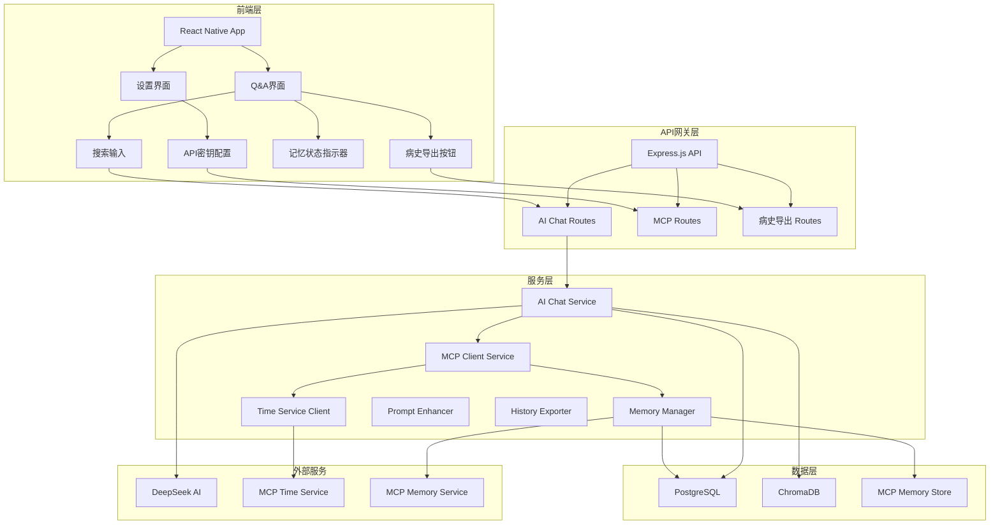
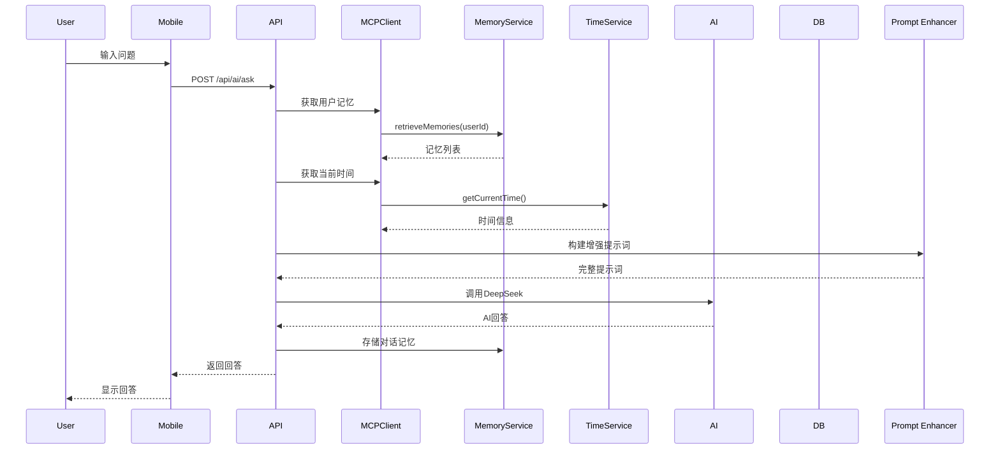

# OpenRD知识库项目MCP集成详细设计方案

## 1. 概述

本设计方案在现有架构文档（`plans/mcp-integration-architecture.md`）基础上，进一步细化了MCP（Model Context Protocol）集成到OpenRD AI对话系统的具体实施方案。方案涵盖两个MCP服务（时间服务和记忆服务）的集成、AI提示词更新、病史导出功能、数据库扩展、移动端界面更新以及实施路线图。

### 1.1 设计目标
1. **时间服务集成**：使AI能够获取准确的时间信息，增强时间相关的对话上下文。
2. **记忆服务集成**：实现对话记忆的存储与检索，提供个性化的连续对话体验。
3. **病史导出功能**：一键生成带时间戳的结构化病史文档，方便医患交流。
4. **无缝用户体验**：通过逐步增强的移动端界面，最小化用户学习成本。

### 1.2 核心原则
- **用户隐私优先**：所有记忆数据严格按用户隔离，敏感信息加密存储。
- **渐进增强**：功能分阶段推出，确保系统稳定性。
- **开放标准**：遵循MCP协议，便于未来集成更多服务。

## 2. 整体架构设计

### 2.1 架构组件图



### 2.2 组件职责详解

| 组件 | 职责 | 技术栈 | 对应文件 |
|------|------|--------|----------|
| **MCP Client Service** | 统一管理MCP服务连接、认证、调用 | TypeScript, @modelcontextprotocol/sdk | `apps/api/src/services/mcp-client.service.ts`（新建） |
| **Memory Manager** | 记忆的存储、检索、总结、清理 | TypeScript, PostgreSQL, Axios | `apps/api/src/services/memory-manager.service.ts`（新建） |
| **Time Service Client** | 获取当前时间、格式化时间戳 | TypeScript, Axios | `apps/api/src/services/time-client.service.ts`（新建） |
| **Prompt Enhancer** | 动态生成包含记忆和时间的提示词 | TypeScript, 模板引擎 | `apps/api/src/services/prompt-enhancer.service.ts`（新建） |
| **History Exporter** | 生成病史文档并导出 | TypeScript, pdfkit | `apps/api/src/services/history-exporter.service.ts`（新建） |

### 2.3 数据流序列



## 3. 时间服务集成方案

### 3.1 服务端点
- **URL**: `https://open.bigmodel.cn/api/mcp-broker/proxy/time/mcp`
- **协议**: HTTP REST
- **认证**: API Key（智谱平台获取）

### 3.2 API密钥管理
1. **前端配置界面**：在移动端设置页面添加“MCP时间服务配置”区域，包含：
   - 输入框用于填写API密钥
   - 帮助链接指向智谱平台注册指南
   - 测试连接按钮
2. **后端存储**：用户密钥加密后存储在`user_settings`表或新增`mcp_credentials`表中。
3. **密钥使用**：每次调用时间服务时，从数据库获取对应用户的密钥，通过`Authorization`头或查询参数传递。

### 3.3 客户端实现
```typescript
// apps/api/src/services/time-client.service.ts
interface TimeResponse {
  current_time: string; // ISO 8601格式
  timezone: string;
  timestamp: number;
}

class TimeClientService {
  constructor(private apiKey: string) {}

  async getCurrentTime(): Promise<TimeResponse> {
    const response = await axios.get(
      'https://open.bigmodel.cn/api/mcp-broker/proxy/time/mcp',
      {
        headers: { 'Authorization': `Bearer ${this.apiKey}` },
        timeout: 5000,
      }
    );
    return response.data;
  }
}
```

### 3.4 调用时机
- 在每次AI对话请求开始时调用
- 时间信息注入到提示词中（见第5节）
- 缓存时间结果5分钟，避免频繁调用

## 4. 记忆服务集成方案

### 4.1 服务部署
- **源代码**: https://github.com/modelcontextprotocol/servers/tree/main/src/memory
- **部署方式**: Docker容器独立运行
- **网络配置**: 通过内部网络与后端服务通信（如 `http://memory-service:8080`）

```yaml
# docker-compose.yml 新增服务
memory-service:
  image: mcp/memory-server:latest
  ports:
    - "8080:8080"
  volumes:
    - memory-data:/data
  environment:
    - MCP_SERVER_PORT=8080
```

### 4.2 记忆数据结构
```typescript
interface MemoryContent {
  id: string; // MCP服务生成的唯一ID
  userId: string;
  type: 'symptom' | 'conversation' | 'preference';
  summary: string; // 精简总结（AI生成）
  content: {
    originalText: string; // 原始对话内容
    extractedSymptoms?: Array<{
      description: string;
      severity: number; // 1-10
      timeContext: string; // 时间上下文描述
      occurredAt?: string; // ISO时间（如可推断）
    }>;
    concerns: string[]; // 用户关注点
  };
  metadata: {
    source: 'ai-extracted' | 'manual' | 'system';
    conversationId?: string;
    createdAt: string;
  };
}
```

### 4.3 记忆生成时机
1. **对话后自动提取**：每次AI对话结束后，使用专用提示词（见5.3节）从对话中提取关键医疗信息。
2. **手动标注**：用户可手动标记重要语句为记忆。
3. **症状时间线更新**：当识别到症状描述时，自动创建或更新症状时间线记录。

### 4.4 记忆检索机制
- **检索时机**：每次对话开始前，检索最近30天内的相关记忆。
- **相关性算法**：基于症状关键词、时间接近度、记忆类型进行加权排序。
- **返回格式**：返回最多5条最相关记忆的摘要，用于提示词构建。

## 5. AI提示词更新方案

### 5.1 系统提示词增强
```typescript
// apps/api/src/services/prompt-enhancer.service.ts
const ENHANCED_SYSTEM_PROMPT = `
你是一个专业、友善的FSHD（面肩肱型肌营养不良症）健康科普助手。请严格遵循：

1) 优先依据"知识库资料片段"作答；不要编造不在片段中的事实
2) 用中文、分点、通俗易懂
3) 给出可执行的下一步建议（该看什么科/问医生什么/做什么检查）
4) 每次都要提醒：这不是医疗诊断，需咨询专业医生
5) 若片段不足以支持结论，明确说"知识库中未找到依据"

【记忆功能使用指南】
- 我会提供用户的历史对话记忆和症状时间线
- 请参考这些记忆来提供更个性化的建议
- 如果记忆中有时间信息，请在回答中提及时间上下文
- 当用户描述新症状时，可与历史症状进行对比分析

【时间功能使用指南】
- 当前时间是：{currentTime}
- 请在回答中适当提及时间相关性（如"最近"、"上周"、"三个月前"）
- 对于症状描述，帮助用户建立时间线认知
`;
```

### 5.2 用户提示词模板
```typescript
function buildUserPrompt(
  question: string,
  userContext: UserContext,
  memories: Memory[],
  currentTime: string,
  knowledgeContext: string
): string {
  return `
【用户信息】${JSON.stringify(userContext || {})}

【当前时间】${currentTime}

【历史记忆摘要】
${memories.length > 0 
  ? memories.map(m => `- ${m.summary} (${formatTime(m.createdAt)})`).join('\n')
  : '暂无相关历史记忆'}

【知识库资料片段】
${knowledgeContext}

【用户问题】
${question}

请结合用户的历史记忆和时间上下文，提供个性化的回答。
`;
}
```

### 5.3 记忆提取提示词
```typescript
const MEMORY_EXTRACTION_PROMPT = `
请从以下对话中提取关键医疗信息作为记忆：

对话内容："{conversation}"

请提取：
1. 提到的症状或健康问题（描述、严重程度1-10、时间上下文）
2. 用户关注的重点或担忧
3. 重要的个人偏好或习惯

格式为JSON：
{
  "symptoms": [
    {"description": string, "severity": number, "timeContext": string}
  ],
  "concerns": [string],
  "summary": "一句话总结本次对话的核心医疗信息"
}
`;
```

## 6. 病史导出功能设计

### 6.1 API端点设计
| 端点 | 方法 | 描述 | 请求体 |
|------|------|------|--------|
| `/api/medical-history/export` | POST | 生成病史文档 | `{ exportType: 'full'/'timeline'/'summary', dateRange?: {start, end}, format: 'pdf'/'json'/'txt' }` |
| `/api/medical-history/exports` | GET | 获取导出历史 | `{ page?: number, limit?: number }` |
| `/api/medical-history/download/{exportId}` | GET | 下载导出文件 | - |

### 6.2 导出数据结构
```typescript
interface MedicalHistoryExport {
  patientInfo: {
    userId: string;
    name?: string;
    age?: number;
    // 其他匿名化信息
  };
  timeline: Array<{
    date: string;
    type: 'symptom' | 'conversation' | 'medical_event';
    description: string;
    severity?: number;
    source: string;
    relatedMemoryId?: string;
  }>;
  summary: {
    symptomOverview: string;
    trendAnalysis: string;
    recommendations: string[];
  };
  generatedAt: string;
  exportId: string;
}
```

### 6.3 PDF生成方案
- **库选择**: `pdfkit`（Node.js）或 `@react-pdf/renderer`（React Native）
- **模板设计**: 专业医疗报告风格，包含：
  - 患者信息（匿名化）
  - 症状时间线图表（可选）
  - 详细症状描述
  - AI分析总结
  - 免责声明
- **异步生成**: 使用任务队列（Bull）处理大型导出，避免阻塞API。

### 6.4 前端集成
1. **导出按钮位置**：在Q&A界面的搜索结果区域添加"导出病史"按钮。
2. **导出选项模态框**：点击后弹出选项（导出范围、格式、时间范围）。
3. **下载管理**：导出任务完成后通知用户下载。

## 7. 数据库扩展设计

### 7.1 新增表结构（补充现有设计）
```sql
-- 记忆元数据表（链接MCP记忆服务）
CREATE TABLE memory_metadata (
    id UUID PRIMARY KEY DEFAULT uuid_generate_v4(),
    user_id UUID NOT NULL REFERENCES app_users(id),
    mcp_memory_id VARCHAR(255) NOT NULL UNIQUE,
    memory_type VARCHAR(50) NOT NULL CHECK (memory_type IN ('symptom', 'conversation', 'preference')),
    summary TEXT NOT NULL,
    raw_content JSONB, -- 原始记忆内容（加密存储）
    conversation_id UUID REFERENCES chat_sessions(id),
    created_at TIMESTAMPTZ DEFAULT NOW(),
    indexed_at TIMESTAMPTZ DEFAULT NOW(),
    expires_at TIMESTAMPTZ -- 可选：记忆过期时间
);

-- 病史导出记录表
CREATE TABLE medical_history_exports (
    id UUID PRIMARY KEY DEFAULT uuid_generate_v4(),
    user_id UUID NOT NULL REFERENCES app_users(id),
    export_type VARCHAR(50) NOT NULL CHECK (export_type IN ('full', 'timeline', 'summary')),
    file_format VARCHAR(10) NOT NULL CHECK (file_format IN ('pdf', 'json', 'txt')),
    file_path TEXT NOT NULL,
    file_size INTEGER NOT NULL,
    memory_ids TEXT[], -- 引用的记忆ID数组
    export_options JSONB DEFAULT '{}',
    generated_at TIMESTAMPTZ DEFAULT NOW(),
    expires_at TIMESTAMPTZ,
    download_count INTEGER DEFAULT 0
);

-- 症状时间线表
CREATE TABLE symptom_timeline (
    id UUID PRIMARY KEY DEFAULT uuid_generate_v4(),
    user_id UUID NOT NULL REFERENCES app_users(id),
    symptom_description TEXT NOT NULL,
    severity INTEGER CHECK (severity >= 1 AND severity <= 10),
    occurred_at TIMESTAMPTZ NOT NULL,
    recorded_at TIMESTAMPTZ DEFAULT NOW(),
    source_type VARCHAR(50) CHECK (source_type IN ('conversation', 'manual', 'ai_extracted')),
    memory_id UUID REFERENCES memory_metadata(id),
    confidence_score DECIMAL(3,2) DEFAULT 1.0
);

-- MCP服务凭证表
CREATE TABLE mcp_credentials (
    id UUID PRIMARY KEY DEFAULT uuid_generate_v4(),
    user_id UUID NOT NULL REFERENCES app_users(id) UNIQUE,
    service_type VARCHAR(50) NOT NULL CHECK (service_type IN ('time')),
    api_key_encrypted TEXT NOT NULL, -- 加密存储
    is_valid BOOLEAN DEFAULT TRUE,
    last_used_at TIMESTAMPTZ,
    created_at TIMESTAMPTZ DEFAULT NOW(),
    updated_at TIMESTAMPTZ DEFAULT NOW()
);
```

### 7.2 索引优化
```sql
-- 记忆检索索引
CREATE INDEX idx_memory_metadata_user_type_time ON memory_metadata(user_id, memory_type, created_at DESC);
CREATE INDEX idx_memory_metadata_conversation ON memory_metadata(conversation_id);

-- 症状时间线查询索引
CREATE INDEX idx_symptom_timeline_user_time ON symptom_timeline(user_id, occurred_at DESC);
CREATE INDEX idx_symptom_timeline_severity ON symptom_timeline(severity);

-- 导出记录索引
CREATE INDEX idx_history_exports_user_time ON medical_history_exports(user_id, generated_at DESC);
```

## 8. 移动端界面更新设计

### 8.1 Q&A界面增强（`apps/mobile/screens/p-qna/index.tsx`）
1. **病史导出按钮**：
   ```tsx
   // 在搜索结果区域添加
   {showSearchResult && (
     <TouchableOpacity 
       style={styles.exportButton}
       onPress={handleExportHistory}
     >
       <FontAwesome6 name="file-export" size={14} color="#969FFF" />
       <Text style={styles.exportButtonText}>导出病史</Text>
     </TouchableOpacity>
   )}
   ```

2. **记忆状态指示器**：
   ```tsx
   // 在搜索框附近添加记忆状态图标
   <TouchableOpacity onPress={showMemoryStatus}>
     <FontAwesome6 name="brain" size={16} color={hasMemories ? "#5147FF" : "#CCCCCC"} />
     <Text style={styles.memoryCount}>{memoryCount}</Text>
   </TouchableOpacity>
   ```

### 8.2 新增设置界面
创建新的设置屏幕 `apps/mobile/screens/p-mcp-settings/index.tsx`：
- **API密钥配置**：输入框、测试连接按钮、状态显示
- **记忆管理**：查看/删除记忆、清除所有记忆
- **导出历史**：查看以往导出的病史记录

### 8.3 导出选项模态框
设计一个全屏模态框，包含：
- 导出类型选择（完整病史/时间线/摘要）
- 时间范围选择器（开始日期、结束日期）
- 格式选择（PDF/JSON/文本）
- 生成按钮和取消按钮

## 9. 实施路线图

### 阶段1：基础MCP集成（2-3周）
| 任务 | 负责人 | 交付物 |
|------|--------|--------|
| 1.1 搭建MCP客户端服务框架 | 后端开发 | `mcp-client.service.ts` |
| 1.2 集成时间服务（含API密钥管理） | 后端开发 | 时间服务调用接口 |
| 1.3 更新AI提示词模板 | 后端开发 | 增强版提示词系统 |
| 1.4 前端API密钥配置界面 | 前端开发 | 设置页面UI |
| 1.5 单元测试与集成测试 | 测试工程师 | 测试用例报告 |

### 阶段2：记忆功能实现（3-4周）
| 任务 | 负责人 | 交付物 |
|------|--------|--------|
| 2.1 部署MCP记忆服务容器 | DevOps | Docker Compose配置 |
| 2.2 实现记忆存储和检索 | 后端开发 | `memory-manager.service.ts` |
| 2.3 开发记忆提取逻辑 | 后端开发 | 记忆提取提示词与解析 |
| 2.4 更新数据库表结构 | 数据库管理员 | 迁移脚本 |
| 2.5 前端记忆状态显示 | 前端开发 | Q&A界面记忆指示器 |

### 阶段3：病史导出功能（2-3周）
| 任务 | 负责人 | 交付物 |
|------|--------|--------|
| 3.1 实现病史生成算法 | 后端开发 | `history-exporter.service.ts` |
| 3.2 开发PDF生成模块 | 后端开发 | PDF模板与生成器 |
| 3.3 创建导出API端点 | 后端开发 | REST接口 |
| 3.4 前端导出界面 | 前端开发 | 导出按钮与模态框 |
| 3.5 异步任务队列集成 | 后端开发 | Bull队列处理 |

### 阶段4：优化与测试（1-2周）
| 任务 | 负责人 | 交付物 |
|------|--------|--------|
| 4.1 性能优化与缓存策略 | 后端开发 | 性能测试报告 |
| 4.2 安全性测试与加固 | 安全工程师 | 安全评估报告 |
| 4.3 用户体验测试 | 产品经理 | 用户反馈报告 |
| 4.4 文档编写与培训 | 技术文档工程师 | 用户手册与API文档 |
| 4.5 生产环境部署 | DevOps | 部署清单与监控配置 |

## 10. 风险评估与缓解

| 风险 | 影响 | 缓解措施 |
|------|------|----------|
| **MCP服务不可用** | 高 | 实现降级方案：时间服务不可用时使用系统时间；记忆服务不可用时跳过记忆检索 |
| **记忆数据泄露** | 高 | 数据加密存储、严格访问控制、定期安全审计 |
| **API密钥泄露** | 高 | 前端传输加密、后端加密存储、密钥轮换机制 |
| **性能瓶颈** | 中 | 实现记忆缓存、异步处理导出任务、数据库查询优化 |
| **医疗合规风险** | 高 | 明确免责声明、用户知情同意、数据匿名化处理 |
| **用户接受度低** | 中 | 渐进式功能推出、用户教育材料、快速反馈渠道 |

## 11. 成功指标

1. **功能完成度**：所有MCP功能按计划实现，通过验收测试。
2. **性能指标**：AI回答时间增加 < 500ms（与基线对比）。
3. **用户满意度**：病史导出功能使用率 > 30%（上线后一个月）。
4. **系统稳定性**：MCP服务可用性 > 99%，平均响应时间 < 2秒。
5. **数据准确性**：记忆提取准确率 > 85%（人工抽样评估）。
6. **安全性**：零安全事件，所有渗透测试通过。

## 12. 附录

### 12.1 相关文件列表
- `apps/api/src/routes/ai-chat.routes.ts` - 现有AI对话路由
- `apps/api/src/services/ai-chat.service.ts` - 现有AI服务
- `apps/mobile/screens/p-qna/index.tsx` - 移动端Q&A界面
- `plans/mcp-integration-architecture.md` - 原始架构设计
- `db/migrations/003_complete_chat_system.sql` - 聊天系统表结构

### 12.2 技术决策记录
- **MCP客户端SDK**：使用`@modelcontextprotocol/sdk`官方库，确保协议兼容性。
- **PDF生成库**：选择`pdfkit`，因为其在Node.js生态中成熟且功能完整。
- **记忆服务部署**：独立Docker容器，便于版本管理和水平扩展。
- **缓存策略**：Redis缓存最近记忆和时间数据，减少MCP服务调用。

### 12.3 待定事项
1. 智谱时间服务的具体API响应格式（需进一步测试）
2. MCP记忆服务的详细API文档（需查阅源代码）
3. PDF模板的医疗专业设计（需医疗专家审核）

---

*本详细设计方案基于现有架构文档，细化了实施层面的技术决策、接口定义和开发计划。建议按照实施路线图分阶段推进，每个阶段结束后进行评审和调整。*